# Teach your Raspberry Pi to Sniff with BME690
In this tutorial we cover the recording of data, training the AI model, and deploying the model to a Raspberry Pi. The process is the same irrespective of the MCU that you are targeting, only the final step is specific to your target hardware.

# BME690
BoschSensortec released the BME690 sensor in late 2024, as the next generation of air quality sensors, succeeding the BME680 and BME688.  The BME 690 is claimed to be more robust in high humidity environments, have a lower power consumption, and conform to WELL/RESET standards for IAQ.

## BME690 Devkit Hardware
The BME690 DevKit became available in early 2025, and uses the Application Board 3.1, 8x BME690 Shuttle Board, and the DevKit software. The Application Board is a general prototyping platform (Arduino) for a range of Bosch Sensortec sensors,using a daughter card called a 'Shuttle Board' for the sensor and a mount on the Application Board 3.1. The interchangeable sensors (shuttle boards) communicate with the Application Board 3.1 via SPI/I2C and GPIO pins. The Applicaton Board has a Cortex M4 cpu and both internal and external flash storage, with an MTP (simple file system used by music players) application preloaded to present the external flash as file system when connected to a PC.

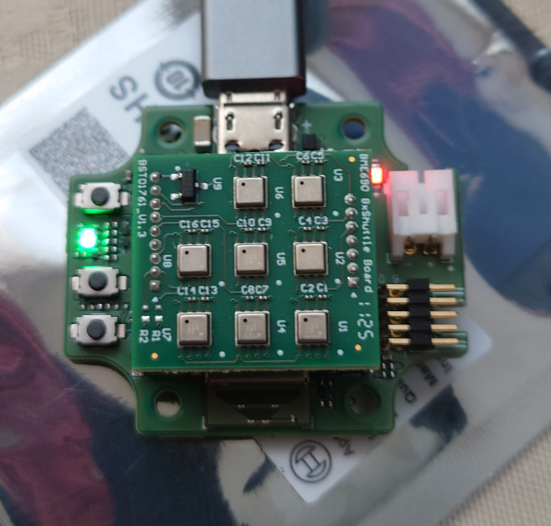

In the image above the 8 x BME690 sensor is shown mounted on the Application Board 3.1, the green light shows it is in MTP (Media Transport Protoc0l) mode and the red indicates power.

The Application Board has a U-Blox NINA-B30 processor (Cortex M4), with bluetooth low energy (BLE, Bluetooth 5) support, a micro-usb (USB2) connection, Stemma/QT connector, and a 2 pin JST connector for a Li-ion battery. The Application Board is Version 3.1 and there are two BME 690 Shuttle Boards - a single sensor (S/N 0440.SB4.048) and an eight sensor Shuttle board (S/N 0440.SB9.048).   So this is an ARM Cortex M4F cpu with 1MB  internal flash, 250MB external flash, 256Kb ram, plus the nordic nRF52840 chipset.

Below is the Application Board showing the mount used by the shuttle boards (1x 690 shuttle shown).

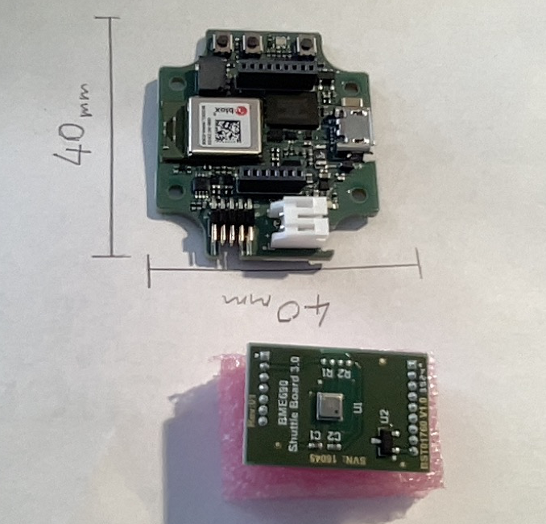

Note the Application Board connector is micro-usb (not usb-c).

On its own the 8x BME690 looks like this.
 
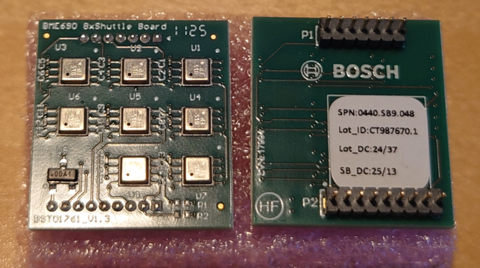

The Shuttle Boards have a pin spacing of 1.27mm which is too small for a standard breadboard. The shuttle board flyer notes for the 8x and 1x shuttles show the pin outs and mounting dimensions. 

## BME690 Module
On the Raspberry Pi I have two Pimoroni BME690 sensor modules, connected by I2C on address 0x77 and 0x76.
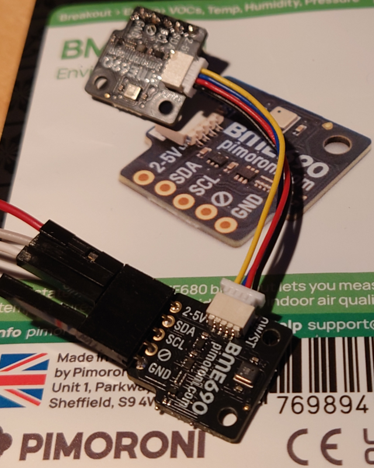

## Software Versions
To get started the following Bosch Sensortec software is required:

| Name                                   | File & Ver                                   |
|:---------------------------------------|:---------------------------------------------|
| BOSCH Sensortec AI-Studio  Windows     | AI-Studio-Desktop - Version    3.2.0.0       |
| BOSCH Sensortec COINES_SDK, Windows    | Coines_sdk v2.12.2 from COINES_SDK on Github |
| BOSCH Sensortec BME690 Development kit | bme690_development_kit v3.1.1                |
| BOSCH Sensortec BSEC Software          | BSEC version  v3.3.0.0                       |
| BOSCH Sensortec AI-Studio Mobile App   | Google Play Store (Android only)             |

At the time of writing this is available from [here:](https://www.bosch-sensortec.com/software-tools/software/bme688-and-bme690-software/#Devkitapp)  apart from the COINES_SDK which is available [here:](https://github.com/boschsensortec/COINES_SDK) see the installers folder for pre-built COINES binaries.

Much of this software requires agreeing to a licence by form filling, then following a download link sent to your email address. If you have used Bosch Sensortec software before this will be familiar. 

In the BME690 Development Kit the instructions say it requires the download and install of MINGW a Windows version of gcc and ARM cross compilers. The instructions for installing and setting paths are in the Readme.md supplied with the BME690_devkitfw_3.1.0 zip file. Initially this was  only required if you intend to compile the COINES_SDK examples .c source, but more recent releases have tools with dynamic links to the gcc runtime library which is required. This is tricky as Mingw is constantly updating.  

If you previously used the BME688 devkit then you will have installed  the silicon labs usb-serial driver  and it works fine with the BME690-Devkit. If not you may need to install a usb-serial driver. The BME690-Devkit is dependent on COINES to provide the comms with the Application Board 3.1 and the Application Board 3.1 firmware updates come with the COINES_SDK releases (requires tracking the github releases). 

## Install
AI Studio Desktop is a Windows only application, so I am assuming installation on a Windows PC. I cover alternatives at the end of this tutorial. 

The minimal install steps are:
- AI-Studio for Windows is a zip file download, and is simply unpacked into a directory of your choice. 
- COINES_SDK is a zip download from Github (link shown above in Software section). The Windows installer is in the installers' folder.  Run the installer, it installs in C:\COINES_SDK, and there is a un-installer in that folder.
- Install the COINES_SDK usb driver by running C:\COINES_SDK\v2.12.2\driver\app_board_usb_driver.exe You might not need this if you have the silicon-lab usb serial driver installed. 
- BME690 Development Kit is a zip file, and unpacks to a directory of your choice. 
- Reboot the PC

So we now have the minimum to get this working: AI-Studio to create the board config, the COINES_SDK usb to uart bridge driver installed to communicate with the Application Board 3.1, and the BME690 Development Kit for the data collection sample app and converter. 

Let's connect the Application Board 3.1 to the PC, by pressing the right most button and then plugging in the USB cable to the PC. This is a little tricky as you have one hand holding the Application Board button and have to push in other end of the cable to the PC USB port.  

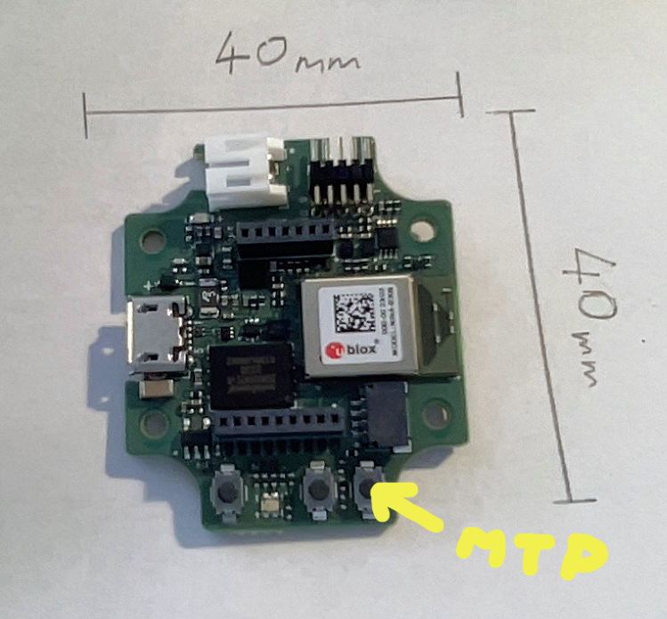

If all goes well the Application Board has one red and one green led lit up, and you can stop pressing the right hand button. The red led is the power led, and the green led shows that the MTP firmware, selected at boot by pressing down the right hand button, has booted and is working.   The MTP firmware is pre-loaded on the Application Board 3.1 and presents the external flash memory as a drive in Windows File manager. (This is where the board config and data are stored.).  The image below shows the COINES_SDK bridge driver exe file and how the Application Board 3.1 appears in Windows File manager in MTP Mode.

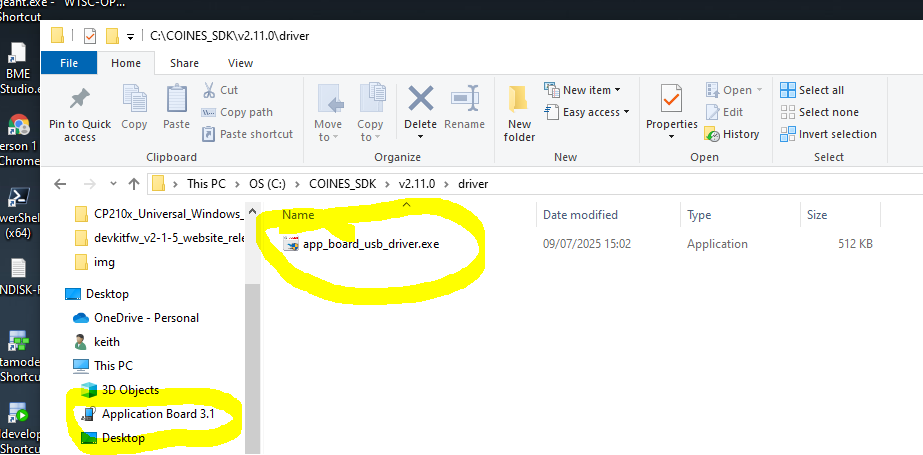

It took some time to get this to work, it was fussy about the USB cable, and I found looking at device manager it was showing no sign of a virtual comm port. 

When it works in MTP mode (red & Green LED) it looks like this. In Windows File Manager the Flash is reported as 250MB in size, however recorded data is compressed to maximise the space usage. 

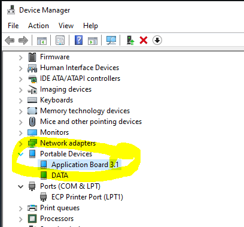

And when plugged and powered on with two red LED's (no MTP button) it looks like this.

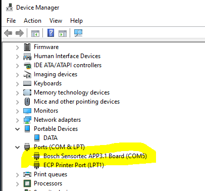

And if it does not look like one of the above then the PC and the Application Board 3.1 are not talking and that needs fixing before trying anything else. 

Note: MTP is a protocol to support music players: track listing, copying, files etc. It is a simple file list, which does not support time stamps or folders so clean it out regularly. In later releases of COINES_SDK the MTP firmware has become more robust, so do update the firmware.  

### Firmware update
COINES SDK 2.12.2 comes with updates to the bootloader and MTP applications, and they install as follows:
The boot loader update is in c:\COINES_SDK\v2.12.2\firmware\app3.1\bootloader_update, and it goes like this.

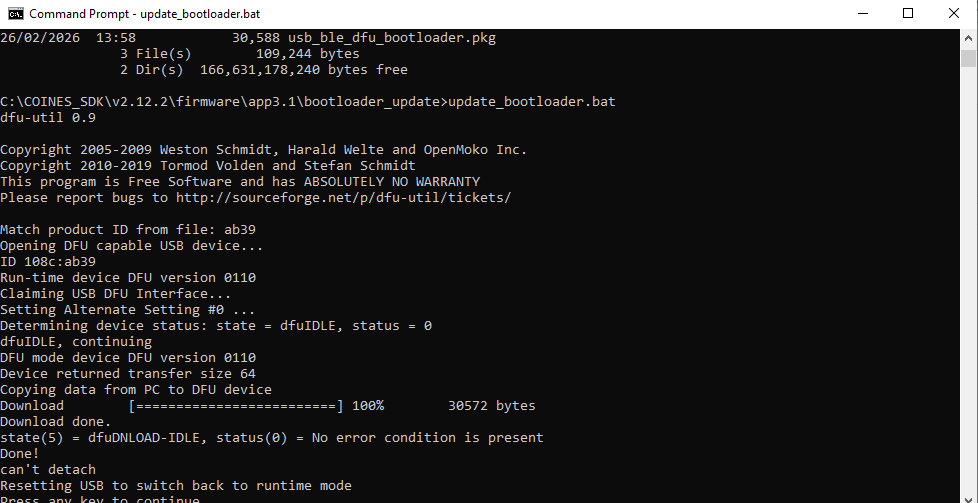

The MTP (file system support) is in c:\COINES_SDK\v2.12.2\firmware\app3.1\mtp_fw_update

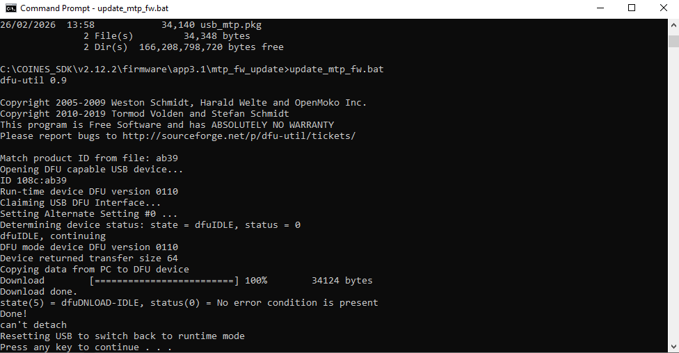

### Flashing the Demo Sample Application

The demo_sample is in the bin directory of the BME690 Devkit, and this is the data recorder application that provides the BLE connectivity to AI Studio Mobile app.

Plug in the Application Board with the 8x BME690 shuttle, and let it sit with two red lights.

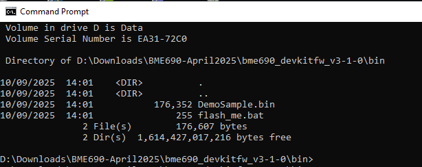

Run Flash.bat, and it should go like this.

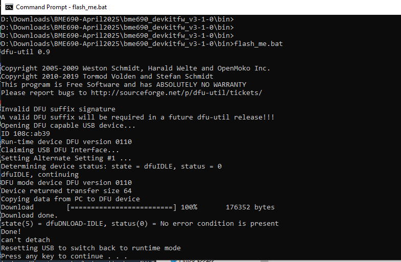

The SampleApp data recorder needs to have a config in order to work. So we need to create a board configuration file in AI Studio Windows, and copy that to the Application Board 3.1 external flash, and power cycle the board to load the SampleApp with the board configuration. 

First create a new project in AI Studio selecting the 8x BME690 as the target.

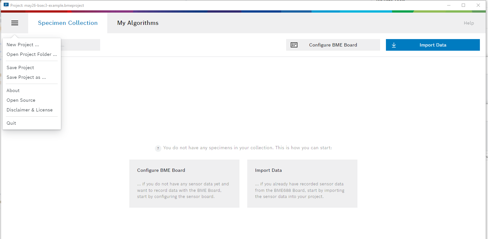

In the figure below the default heater profile and duration is selected, so click on the save as at the bottom of the page and save it to file. Scroll down to the bottom of the page to find the button as shown below.

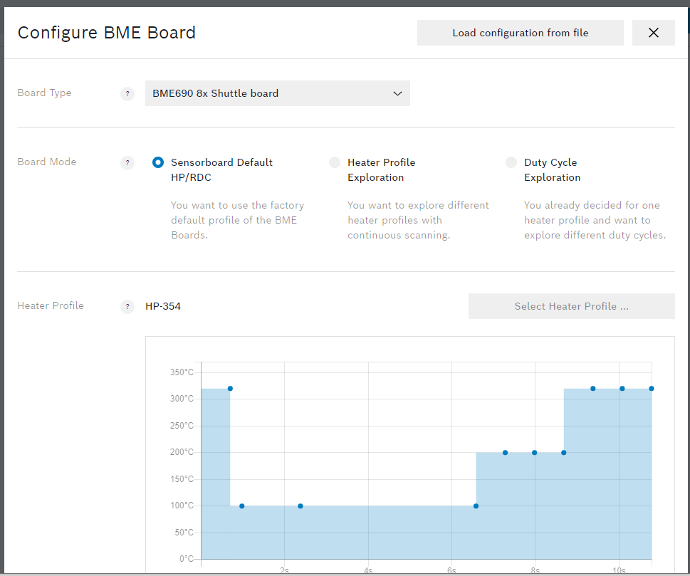

To copy this config to the Application Board 3.1 we need it in MTP mode, so unplug the Application Board 3.1 from power, hold down the right button and connect the USB to the PC to load the MTP firmware. Use file manager (as shown below) to copy the saved board config file to the Application Board 3.1 external flash. When that is complete power cycle the Application Board 3.1.

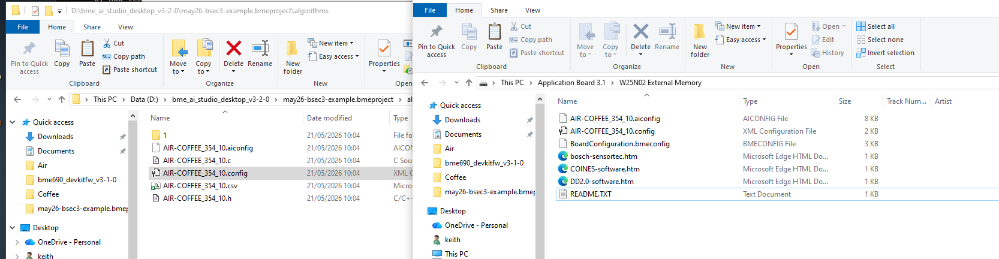

At this point the Application Board 3.1 is ready to start recording when rebooted. It flashes red and blue to indicate recording and writing data. The Application Board 3.1 can be unplugged from the PC and connected to a power bank or LiPO battery, and it will start recording data on connection to the power bank (for LiPO the left hand button acts as on/off), the LED flashes blue as it writes data to the flash storage. Leave it for ~15 min to record out some data then pull the power to stop recording, and plug it back into the PC with the right button pressed to launch MTP mode. 

Use Windows File Manager to access the Application Board 3.1 Flash storage and copy the data files to your AI Studio project folder. Data is recorded on the Applicaton Board in a compressed format, and needs to be converted on the PC before importing into the AI Studio project. The BME690 Development Kit provides a conversion utility, with a .bat script to convert files, and to use it copy three files ( .labelinfo, .udf, and .bmeconfig) to the folder bme690_devkit\tools\converter\data and run the batch file run_me.bat which will create a subfolder called "output" to hold the converted label and data files. Copy the output files (.bmelabelinfo and  .bmerawdata) back to the AI Studio project folder, these are files that AI Studio Windows will import. In my experience this batch converter only converts one file at a time. 

File handling and management is not great with the Application Board/BME690 Development Kit, there is no real time clock so all time stamps are relative to power on, and the data format (.udf) needs conversion before AI Studio Desktop can import it . So that makes it important to use session and label info to help you sort out what data it is your looking at in AI-Studio Windows, and I suggest that using AI-Studio Mobile is the answer to managing data recording and testing ai-models. It is possible to use buttons on the Application Board 3.1 to mark session changes while recording but AI Studio mobile offers so much more control and features to manage the process.

## AI-Studio Mobile
The AI-Studio Mobile app is Android only, and can be found and installed from the Google Play Store. It installs under the name "BME AI Studio" which will help you find it in the sea of other apps.

Using the BME AI Studio app is easy, provided the app is allowed to search and connect to the Application Board 3.1 via bluetooth. If you use Google system tools to add a bluetooth device, like you might a pair of headphones using Settings -> Device Connection ......, it will lead to connection problems in the BME-AI Studio app. Just leave it to the BME AI Studio app to search and connect to the Application Board 3.1 and all will be well. The video below shows a new connection being made using AI Studio Mobile. If you have paired using the google tools then you will need to go into the bluetooth settings and "forget" the device, then try again with the BME AI Studio app.

### Recording Data
Once the App has discovered BMExx Development Kits it lists them, and when the phone is close (BLE is detected) the connect button lights up blue.  The Ai Studio Mobile app has two functions: managing data collection and testing AI Models. In collecting data the appp can create new sessions and label them, and deep dive into raw data from each of the sensors.  The video below shows the use of an existing Application Board connection (BME AI Studio has seen the 688 devkit and 690 devkits previously), with the initial data recording having a large amount of scatter, the variability reduces and after 15 min or so,  achieving a steady state which is when we label the data and leave it running for at least 30 min.  

Achieving a steady state may require experimenting with the board config - heating and sleep profiles.
The RDC setup is where the sleep profile is set and with the 690, I find it is easier to minimise scatter with a low number or no sleep steps. In IAQ mode having no sleep steps will cause the sensor to heat up and distort the environmental data, but for this task large number of sleep steps mean the heater is not getting consistency (and the advice from Bosch is not use the env data in the AI model).

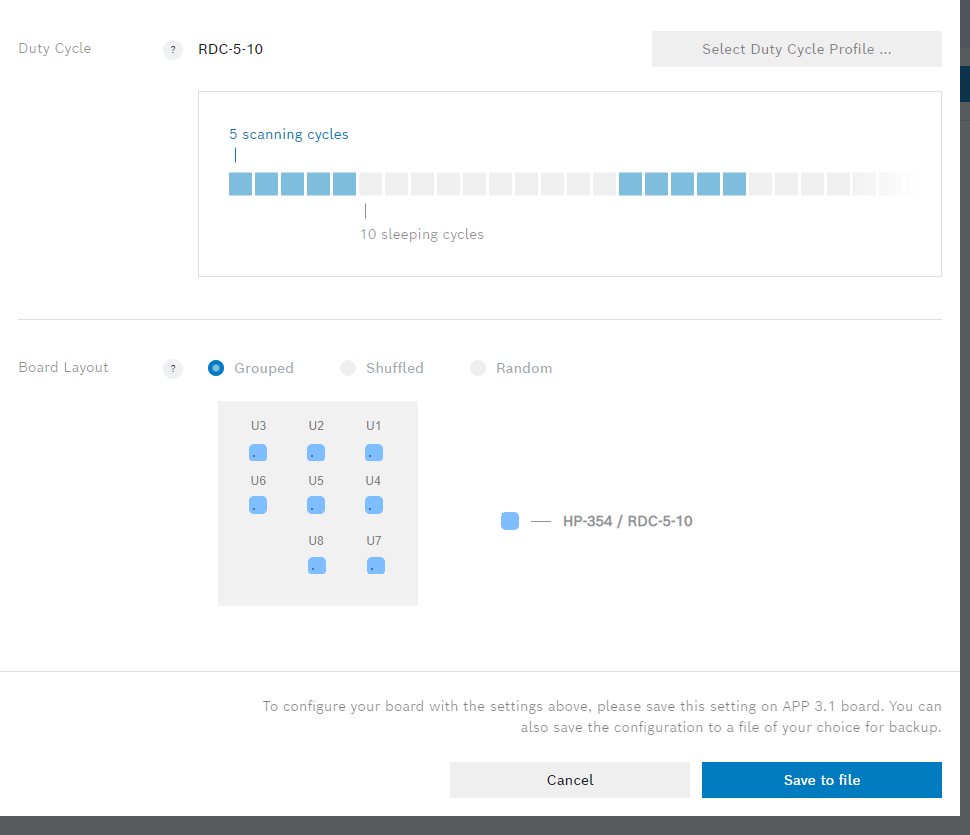

The App is in my view the best way to manage, data recording and labelling, and it lets you see when the sensors have settled down before starting a new recording.

## Importing data
Copying the data from the Application Board 3.1 to the PC is covered above, along with its conversion from .udf to .bmerawdata. Keeping in mind file management issues, I recommend copying and deleting files off the Application Board 3.1. (MTP lacks folders and timestamps)  AI Studio Desktop is shown below with two data sets Coffee and Air with the length of time and number of cycles highlighted.  

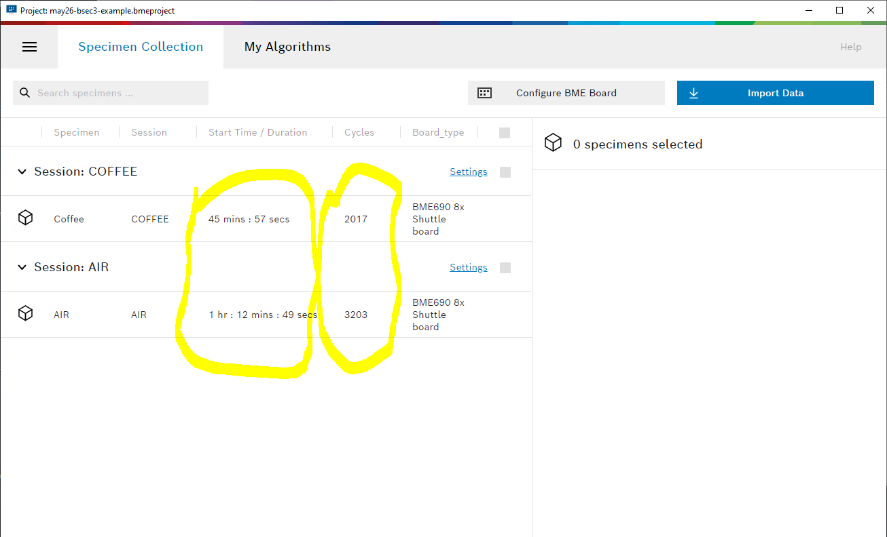

The Air data has more cycles than the Coffee and imbalance is something the model generation will test for. Clicking on the Settings link allows you to adjust (see the blue shading and the start and end times) the sample data to be a better match or focus on a section of data with less variablility. 

## Generating an AI Model
The data preparation above is aimed at making the next steps go smoothly, that is creating the classes (up to 4) from the data you imported. AI Studio Desktop will validate the class data, and it may be necessary to return to the data preparation or to record some more data. 

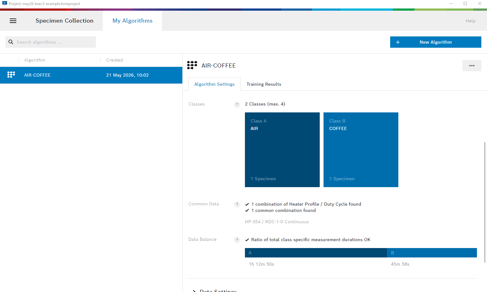

Once AI Studio is happy with you class data, an algorithm is generated and a set of scores are produced to provide insight in the quality of the model generated. In the figure below the yellow highlighting is on the Help Link which explains what these measures are, and is a really useful manual for this set of products.

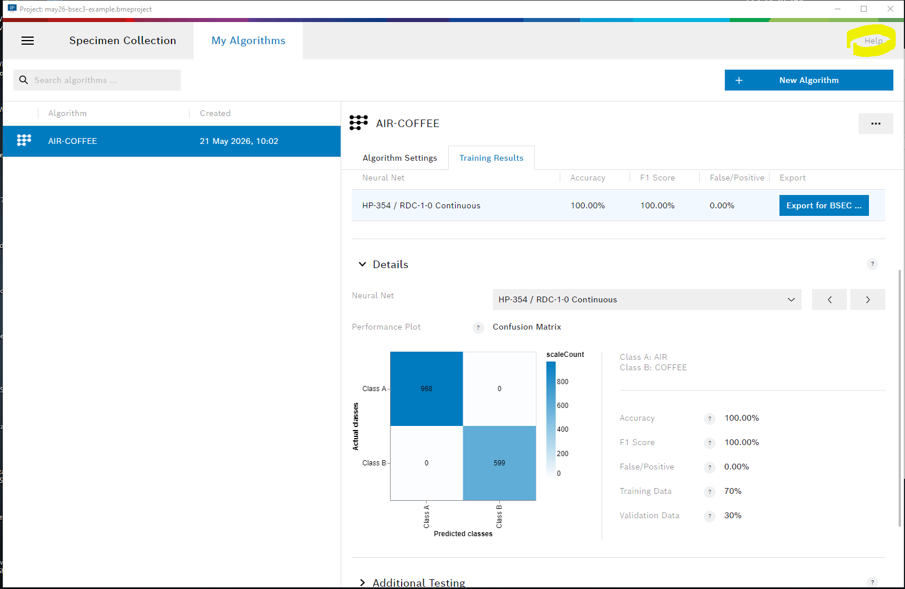

## Testing an AI Model
I have covered generating the AI Model in earlier articles on the BME688 Devkit, and the main change is to be aware of selecting BME688 or BME690 as it defaults to BME688 and you have no data visible as you have just collected BME690 data. And that is a feature: data collected on the BME688 produces AI Models for the BME688 and data from the BME690 produces AI Models for the BME690. There is no interchange of data or models. 

From the AI-Studio Windows algorithm page there is an "Export for BSEC" button, which gives a warning pop-up about the model being for BME690 only, then a screen to choose the BSEC 3 version you wish to target, and finally you can export the model to a storage location of your choice. The .aiconfig and .config files are the ones to copy to the Application Board Flash storage.  To do that power cycle the Application board while holding the right hand button and plugging it into the PC, which brings it up into MTP mode and File Manager can copy and paste the files across.  Power cycle the Application Board again, but without holding down buttons, which start up the sample application data collection. Now connect the AI Studio Mobile app to the Application Board and click on "Live-test algorithm" which reads the .aiconfig file and starts working as shown in the video below.

The AI studio project in the video, is the one supplied in this repository which you can load in AI Studio and modify. 

The help link highlighted in the top right corner, launches the on-line documentation which is extensive. 

# Deploying to your own board
After testing in AI Studio Mobile, you may wish to deploy an AI Model to custom hardware. My experience is with Raspberry PI and the python wrapper for BSEC3. There is a complete AI Studio Desktop project for you to open and experiment with, and an exported AI Model for AIR/COFFEE with the sniff.py program showing how to use the model.  The Python 3 wrapper for BSEC 3.3.0.0 is open source and hosted on GitHub , and the data and AI model are in the tools directory (see the tools/Readme.md). 

## Compatibility with BME688/BME680

So what about compatibility between BME690, BME688, and BME680?  The BME 690 software stack is built for the BME 690, and AI Studio has a very strict BME688 and BME690 divide that prevents mixing of data between the two family's. For the BME690 everything got renamed so even the 690_API is incompatible with BME688.  If you are using BME688, then the BSEC 2 v2.6.1.0  release is reliable and stable. The BME680 is also supported by the BME68x API and BSEC2, but this is rarely seen these days.  BSEC2 v2.6.1.0 is the final release of BSEC2 (Bosch Sensortec MEMS Sensor Forum), and it is becoming hard to find BME688 Devkits.
 
# Alternatives (Mac and Linux)

The COINES_SDK is multi-platform, with installers for both MAC and Linux. The usb-serial issue with Windows missing the driver, does not exist on Linux and MAC and MTP support is also installed as standard.  It is simple to plug the Application Board 3.1 into a Raspberry Pi and see the files on the App Board using the desktop file manager, automatically. In fact automated data collection is very practical via this route. 

Now for the issues:
- The data collected by the Application Board is in .udf format and the Development kit converters are Windows only. AI Studio Desktop requires .bmerawdata format.
- AI Studio Desktop is Windows only. It used to be supported on Mac and Linux, but that support was dropped.

I addressed the first issue writing a family of Python converters to take .udf and convert to excel, csv and .bmerawdata these work on folders as batches or individual files.  Again, this lends its self to automation in preparation of data ready for import into AI Studio.

The last issue is AI Desktop Studio running on Windows only and that is a Bosch Sensortec problem.  

